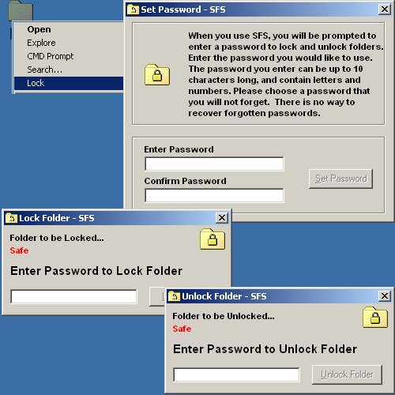



## Folder Locking Program

### Description

I was working on this a while ago, and never finished it, but I have seen a couple of Folder locking program submitted, so I figured I would share my version. It works on the same principle as most, renaming to a special folders corresponding CLSID. It also adds a to the context menu, the option to lock. The only thing I haven't been able to figure out is, how to incorporate my own icon to the locked files. I did figure one way, by making my own special folder CSLID, but when I did this, if you right clicked on a locked file, you would see two opens and also explorer. the one open would open the folder normally. This time I am using my own CLSID as well, but its the same as the windows shortcut (lnkfile). Any feedback is appreciated.
 
### More Info
 

             |
---                |---
**Submitted On**   |2002-03-30 02:31:26
**By**             |[Johneboy](https://github.com/Planet-Source-Code/PSCIndex/blob/master/ByAuthor/johneboy.md)
**Level**          |Beginner
**User Rating**    |4.6 (37 globes from 8 users)
**Compatibility**  |VB 6\.0
**Category**       |[Windows System Services](https://github.com/Planet-Source-Code/PSCIndex/blob/master/ByCategory/windows-system-services__1-35.md)
**World**          |[Visual Basic](https://github.com/Planet-Source-Code/PSCIndex/blob/master/ByWorld/visual-basic.md)
**Archive File**   |[Folder\_Loc667353302002\.zip](https://github.com/Planet-Source-Code/johneboy-folder-locking-program__1-33219/archive/master.zip)

